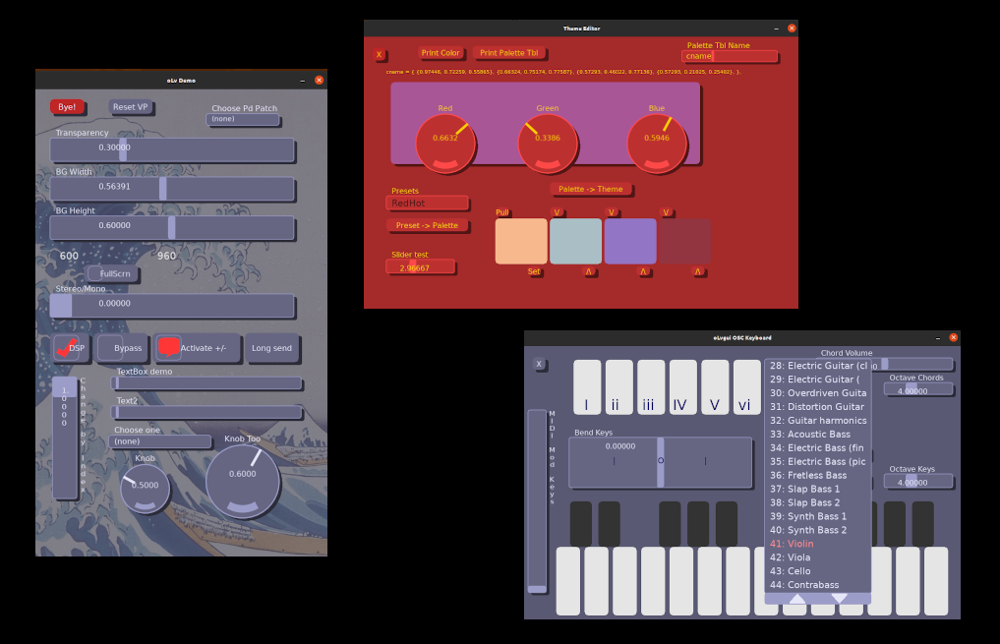

# oLv 
## LÖVE GUI & OSC library modules

### oLv is 'omaggio LÖVE'

...which means 'Homage to Love.' Pronounce it 'Oh-Love'...or basically 'Olive'

*oLv* was written to create easily configurable GUIs for OSC (Open Sound Control) communications between musical effects and synthesizers. Specifically I wrote it to make GUIs for [pd2jack](https://github.com/GModal/pd2jack) in realtime.

*oLv* uses/depends on the **LÖVE** 2d game engine, which is flexible, Lua-driven, cross-platform (Mobile! Linux! Etc!) and very easy to use. *oLvgui* can automatically resize it's interface for mobile devices. It's currently only tested with Linux and Android, however.

The **oLv** modules include:

  * oLvgui : the GUI
  * oLvcolor : color definitions and functions
  * oLvext : extras, currently polygon definitions for the GUI

### Open Sound Control
### olvosc (pure Lua) & olvoscT (LÖVE)

*oLv* includes the *olvosc* module, a 'pure Lua' library for sending/receiving OSC packets via UDP. There's also a LÖVE-specific module, *oLvoscT* which is a threaded OSC server

  * olvosc link
  * olvoscT link

Thx, *D. Garmon*

7/2022

**oLv includes these GUI elements:**

* Button
* Droplist (can function as a menu)
* Knob
* Label
* Marker (not visible, for gui table manipulations)
* Panel (can function as a graphic element, button, image, x/y 2d input)
* Slider
* Txbox

Also:

* A color theme library
* A library of polygons (used by the Button element, but in std LÖVE format)
* Routines to access GUI data and manipulate the GUI list

The OSC modules include:

* Sending/receiving OSC data packets via UDP
* OSC packet data encoding and decoding
* a LÖVE-only threaded OSC server that can run concurrently with the main thread.

## oLv Demos

oLv demo programs, both source and .love files are in these directories in the repository.

  * demo_love
  * demo_src

Follow this link for simple [oLv Demo Documentation](oLvDemos.md). The demo **tinaV1** has [separate docs](demo_love/demo_docs/tinaV1.md), as it depends on Pure Data and a JACK-enabled softsynth.

Any .love files will run under 'LÖVE for Android' app in the Play store. After downloading, they should be launch-able from the Google *Files* app.

**The demo source files are the best documentation, currently...although the info presented below is a start.**

# GUI Elements

Standard definitions for this section:

* gui_table : a table, a list of all the elements in the current GUI
* label : a string, usually displayed above the element
* {options} : a table of options
* {items} : a table of text entries (for droplists)
* x : x origin of element
* y : y origin of element
* width : width of element
* height : height of element
* value : initial value
* min, max : value limits, min may be negative
* color : color setting, explicit for labels and panels
* presetTx : initial text value
* user : an identifier, but the field can be single variable (anything) or a table of anything
* callback : is a custom callback function (use same args as the standard callback)

### Passing Options

An options table looks like this:

    { 'OPTION1', 'OPTION2'}

Can be defined as a table variable (insert in the creation function):

    local myoptions = { 'OPTION1', 'OPTION2'}

## GUI Creation functions

## Button
**oLvgui.createButton(gui_table, label, {options}, x, y, width, height, user (, callback))**

Returns a **Gui Element**

{options} = 

* MOMENTARY : immediate mode, callback on buttonDown (default)
* TOGGLEON : Toggle value, initially ON, uses polygon image
* TOGGLEOFF : Toggle value, initially OFF, uses polygon image

## Droplist
**oLvgui.createDroplist(gui_table, label, {items}, {options}, x, y, width, height, user (, callback))**

Returns a **Gui Element**

{options} = 

* DESELECT : value can be NONE (0), no entry or value (default)
* NO_DESELECT : reselecting an item does nothing
* RESEND_SEL : reselecting an item doesn't change item, but does callback
* MENU : A special kind of Droplist, minimal menu functionality

## Knob
**oLvgui.createKnob(gui_table, label, {options}, x, y, width, height, value, min, max, user (, callback))**

Returns a **Gui Element**

{options} = none

## Label
**oLvgui.createLabel(gui_table, label, {options}, x, y, width, height, color, user)**

Returns a **Gui Element**

{options} = none

Labels have no callbacks.

## Marker
**oLvgui.createMarker(gui_table, label, user)**

Returns a **Gui Element**

{options} = none

Markers have no callbacks. They can be embedded in the GUI table, and are used to delete elements before or after the marker.

## Panel
**oLvgui.createPanel(gui_table, label, {options}, x, y, width, height, color, user (, callback))**

Returns a **Gui Element**

{options} = 

* DROPS_ON : dropshadow ON (default)
* DROPS_OFF : dropshadow OFF
* TYPE_NORM : a normal rectangular panel (default)
* TYPE_INTERACT : an interactive panel, functions as a special type of button
* TYPE_IMAGE : a panel with an attached image
* SHOWHIT : displays an x/y touch-mark for an interactive panel

Panels are a swiss-army knife of functions. They act as visual elements, can display pictures, work as interactive buttons and even return the x,y coords of a hit.

## Slider
**oLvgui.createSlider(gui_table, label, {options}, x, y, width, height, value, min, max, user (, callback))**

Returns a **Gui Element**

{options} = 

* HORIZ : Slider is horizontal (default)
* VERT : Slider is vertical
* SHOWV : show label text vertically (default for VERT)
* NOSHOWV : show label text horizontially
* RETURN : Slider snaps back to initial value when touch moves outside
* NORETURN : no snap back (default)

## Txbox
**oLvgui.createTxbox(gui_table, label, {options}, x, y, width, height, presetTx, user (, callback))**

Returns a **Gui Element**

{options} = none

## Standard Callbacks

* doButton(state, user)
* doDroplist(index, item_text, user)
* doKnob(value, user)
* doPanel(state, user, x, y)
* doSlider(value, user)
* doTxbox(text, user)

## Other:
* oLvquit()

See **Add a close callback** section below.

# Using oLv

## Load the GUI modules

    local oLvgui = require "oLv/oLvgui"
    local oLvcolor = require "oLv/oLvcolor"
    local oLvext = require "oLv/oLvext"

* "oLvgui.lua" contains the GUI definitions
* "oLvcolor"   contains the color and theme defs, etc.
* "oLvext"   (extras) contains polygon defs for buttons, etc.

## Load the OSC modules

    local oLvosc = require "oLv/oLvosc"
    local oLvoscT = require "oLv/oLvoscT"

* "oLvosc"   contains the standard OSC library, client & server
* "oLvoscT"  contains the threaded OSC server

# Using the *oLvgui* module

All the gui functions are accessed with the prefix: **oLvgui**

For example:

    oLvgui.drawoLv(gui)

**Note that the oLv module names all have the 'L' char uppercase...**

## Define a GUI table

Usually just name it 'gui':

    local gui = {}

## Add a close callback

    function oLvquit()
        love.event.quit()
    end

While you can close oLv by calling the Std LÖVE function ( love.event.quit() ) anywhere, it's advisable to define this. If this is present, oLv will close correctly when the user hits the Android 'back' button.

This is especially important with the oLv OSC server modules that use threads (**olvoscT**), as they don't exit gracefully unless the thread is stopped. *Especially* especially if the platform is Android, as orphaned threads aren't automatically halted.

Here's an example:

    function oLvquit()
        local tchn = oLvoscT.getTermChan(chanNm)    -- get the channel to terminate the thread
        oLvoscT.closeServ(tchn)                     -- send a close msg over that channel
        threadT:wait( )                             -- wait for server thread to close...
        love.event.quit()
    end

If the threads are not terminated before LÖVE exits, LÖVE may not restart.

## Set a color theme and screen size, then Initialize the GUI

In the standard LÖVE 'load' callback:

    function love.load()
        local myTheme = oLvgui.createTheme()
        myTheme = oLvcolor.buildColors(oLvcolor.colorT.standard, myTheme)
        oLvgui.initoLv("oLv Demo", 960, 600, myTheme)
        oLvgui.autoScale()

        -- Init the GUI elements here --
    end

The function oLvguit.createTheme() creates a basic color theme.

Running that theme through .buildColors() fleshes out the various supporting colors with a VERY simple algorthym. .buildColors() takes a 'quad' of RGB colors (presets and format found in 'oLvcolor.lua') and builds on that.

oLvgui.initoLv() creates a viewPort def, with a Window name, width, height and a theme. The width and height arguments are only valid for desktop use, but they define a working canvas (and **w:h ratio**) which is very useful when placing GUI elements on the vPort. I.E., don't build a GUI with a w:h of 1920:1080 if the target device is a phone. Even if it's autoscaled (see below) the elements will likely be very small.

The **width:height ratio** also sets Portrait or Landscape mode on a mobile device.

Mobile devices have a predefined Viewport size. The .autoScale() function will take the current viewPort and GUI and automatically size it to the mobile screen. The function is currently defined for Android only. 

Minimally, this should also work:

    function love.load()
        local myTheme = oLvgui.createTheme()
        oLvgui.initoLv("oLv Demo", 960, 600, myTheme)

        -- Init the GUI elements here --
    end

## oLv and GUI scaling

**All** the GUI elements in *oLvgui* are scaled, but the default scaling is 1:1. The autoScale() function (for mobile devices) simply creates scale factors to fit the defined elements into the mobile viewport.

A sample workflow for creating a new interface (on a desktop or laptop):

  * Define a working window with the correct orientation, with **oLvgui.initoLv()** ( using the width, height arguments)
  * The width, height should reflect the target device
  * Place elements that will scale comfortably to the target
  * include **oLvgui.autoScale()** to scale the elements

Put simply: **Don't** use a **large** working window to build a GUI for a *phone*. Or if you do, make the elements HUGE. Otherwise the elements will be too small.

The scaling factors can be manually edited by:

    oLvgui.scaleVP(myXscaler, myYscaler)

But the viewPort won't be created until **oLvgui.initoLv()** has been called.

Also, the scaling factors don't effect the window, just the elements. So on a desktop the defined window size won't change, just the controls.

## Add GUI elements, controls

GUI elements are generally added within the love.load() callback, with creation functions:

    oLvgui.createButton(gui, "Hello World", {'MOMENTARY'}, 200, 240, 320, 60, 'hi')

An element reference can be assigned at creation. The ref variable can be defined early if it's used in any functions or callbacks.

    local cntLbl = oLvgui.createLabel(gui, 'Hello, Luv', {}, 150, 200, 18) 

Elements can also be added (and deleted with *markers*) dynamically.

## Updating and drawing the GUI

Put the oLv update and draw functions within the standard LÖVE callbacks:

    function love.update(dt)
        oLvgui.updateoLv(gui, dt)
    end

    function love.draw()
	   oLvgui.drawoLv(gui)
    end

# A Minimal Example

    -- Hello world minimal
    local oLvgui = require "oLv/oLvgui"
    -- ++++++++++++++++++++++++++++++++++++++++++++++++++++
    local gui = {}

    -- 		GUI callbacks
    function doButton(state, user)
        oLvquit()
    end
    -- Quit when button pressed
    function oLvquit()
        love.event.quit()
    end
    -- +++++++++++++++++++++++++++++++++++++++++++++++++++
    -- Std Love callbacks
    function love.load()
        local myTheme = oLvgui.createTheme()
        oLvgui.initoLv('Hello World One', 960, 600, myTheme)
        oLvgui.createButton(gui, "Hello World", {'MOMENTARY'}, 200, 240, 320, 60, 'hi')
    end

    function love.update(dt)
        oLvgui.updateoLv(gui, dt)
    end

    function love.draw()
        oLvgui.drawoLv(gui)
    end

# Droplists as Menus

Droplist elements can act as *very* simple menus, but the programmer does much of the work.

They display differently from regular droplists:

  * The element label is inside the droplist box, not on top. The label never changes with selections, as it becomes the "menu" title
  * NO items are ever highlighted/selected (although the last selected is still the internal selection)
  * The user catches each selection and alters the item text to 'flag' that item (or multiple items) as *selections*

The demo program **ardourV1** illustrates these techniques...

# Library functions

## Main Callbacks

Place these two callbacks in the standard LÖVE callbacks (see section [Updating and drawing the GUI](#updating-and-drawing-the-gui) above.)

**oLvgui.updateoLv**(gui_table, dtime)

**oLvgui.drawoLv**(gui_table)

## GUI Settings Functions

**oLvgui.initoLv**()

`nil oLvgui.initoLv(windowname, width, height, newTheme, flags)`

  * Initialize the framework

**oLvgui.resetVP**()

`nil oLvgui.resetVP(gui_table, width, height, flags)`

  * Reset the viewPort

**oLvgui.autoScale**()

`nil oLvgui.autoScale()`

  * Set scaling based on the initial width & height, and the device W & H
  * This just sets a flag...

**oLvgui.scaleVP**()

`nil oLvgui.scaleVP(sx, sy)`

  * Explicitly set scaling factors

**oLvgui.setTheme**()

`nil oLvgui.setTheme(gui_table, newTheme)`

  * Set a global theme

**oLvgui.getTheme**()

`theme oLvgui.getTheme()`

  * Get the global theme

**oLvgui.getVPort**()

`viewPort oLvgui.getVPort()`

  * Get the global vPort

## Accessing Element data fields

Many element attributes can be accessed by their keys (i.e., elem.label = 'Hello'). Of course this is generally for setting fields, as the callbacks provide element values when changed.

For direct access, the element must be assigned to a variable (usually when it's created) like this:

    -- above any callbacks or reference, create the variable

    local myLabel

    -- then, in love.load() create the element

    myLabel = oLvgui.createLabel(gui, 'Hello World', {}, 100, 100, 20, {0.9,0.9,0.9})

Subsequently the attributes can be accessed like:

    myLabel.label = 'Goodbye'

Note that the access function **oLvgui.getElementByUser()** can return an element that hasn't been assigned a local variable.

## Using Functions to Access Data

Accessing the internal fields directly works well in many instances. However, SOME elements need to be refreshed and the access functions will set a flag to refresh any dependent values. Droplists, Knobs and Sliders fall in this category.

The access functions also perform some range tests...

## Element Access Functions

**oLvgui.setActive()**

`nil   oLvgui.setActive(gui_table, state)`

  * Change all elements active state (active or inactive)

**oLvgui.setActiveIndex()**

`nil  oLvgui.setActiveIndex(gui_table, index, state)`

  * Set the element #[index] active state (active or inactive)

**oLvgui.setActiveByUser()**

`nil  oLvgui.setActiveByUser(gui_table, user, state)`

  * Find element by it's element.user field, set it's active state (active or inactive)

**oLvgui.getElementByUser()**

`element oLvgui.getElementByUser(gui_table, user)`

  * Get the GUI element with the supplied user field

**oLvgui.getIndexByUser()**

`index oLvgui.getIndexByUser(gui_table, usr)`

  * Get the index # of a specific user field

**oLvgui.deleteElementByUser()**

`nil oLvgui.deleteElementByUser(gui_table, user)`

  * Delete the element with the user field from the gui_table

**oLvgui.setValue()**

`nil oLvgui.setValue(gui_table, index, value)`

  * Set the value of element[index] in the gui list

**oLvgui.setValueByUser()**

`nil oLvgui.setValueByUser(gui_table, user, value)`

  * Find element by it's element.user field, set the value

**oLvgui.setSteps()**

`nil oLvgui.setSteps(element, steps)`

  * Set the number of steps for Sliders and Knobs

**oLvgui.setLabel**

`nil oLvgui.setLabel(gui_table, index, label)`

  * Set the label field of element #[index]

**oLvgui.setLabelByUser**

`nil oLvgui.setLabelByUser(gui_table, user, label)`

  * Find element by it's element.user field, set it's label field

## DropList Functions

**oLvgui.dlSetItems**(element, items)

  * Set the droplist items list to a new list

**oLvgui.dlSetSelect**(element, item)

  * Select an item in the items list

## Marker Functions

**oLvgui.delAfterMarker**(gui_table, user)

  * Delete all elements *after* the marker with matching user field

**oLvgui.delToMarker**(gui_table, user)

  * Delete all elements *before* the marker with matching user field

