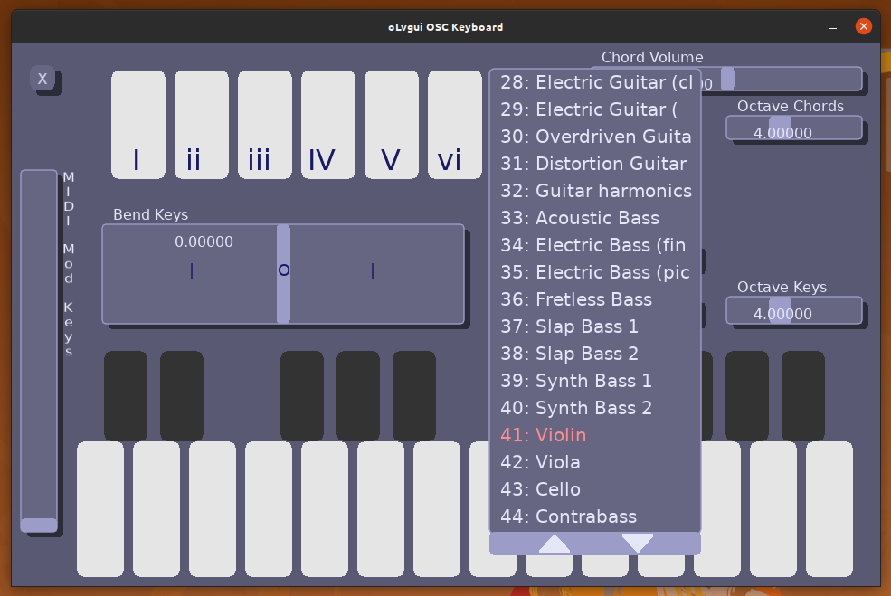
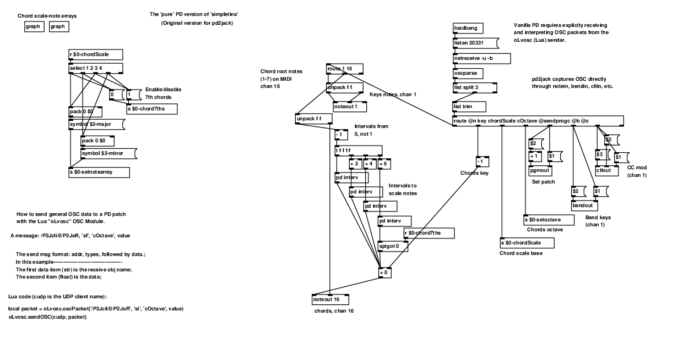
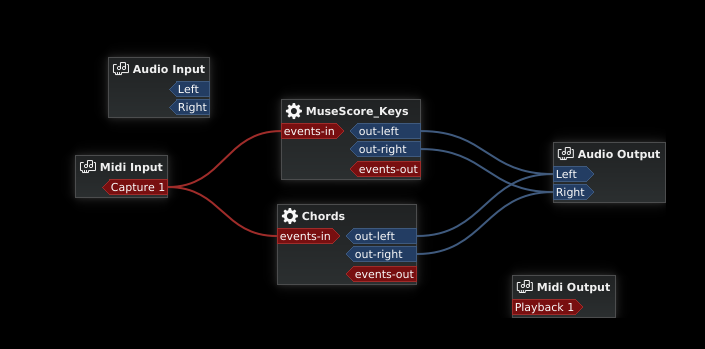
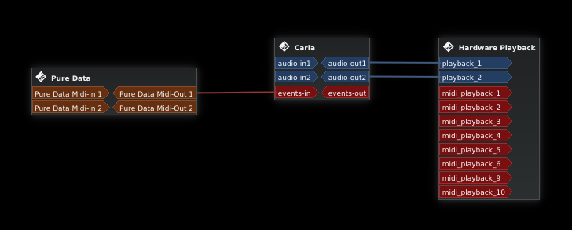

# oLv -- Setting up and using "tinaV1"

**tinaV1.love** is an OSC musical-input performance app aimed at mobile devices and running on the game engine LÖVE (Love2d). OSC controllers are wireless and use UDP packet protocol, so should work with any wireless host. The LÖVE OSC library (oLvosc) will also work on the localhost, so it functions as a desktop interface too.

**tina** is a contraction of the word 'consertina', and like this app is a two-handed musical instrument.

**Pic1** *The tinaV1 app, with an **oLvgui** droplist open...*

Requirements:

* Working JACK or pipewire interfaces
* LÖVE, on the host computer (LÖVE V11.3 on Ubuntu, in my case)
* LÖVE, on the mobile client (LÖVE for Android, V11.3 here)
* Pure Data
* A softsynth with MIDI capabilites (Qsynth, Carla, etc. This example uses Carla).
* A JACK patchbay, such as Claudia is useful

# Getting LÖVE

LÖVE V11.3 is available for Ubuntu (20.04) via atp or a front-end like Synaptic. These library modules haven't been tested on LÖVE V11.4 yet.

'LÖVE for Android' is available via the Play Store. 

While this has been tested exclusively on Linux & Android, there's no reason it wouldn't work on iOS & macs. LÖVE and Pure Data are cross-platform.

# Moving LÖVE files to Android

LÖVE files should be packaged (simply zip all the files within the dir, and rename the .zip suffix as .love) for easy use & transfer on mobile. 

Cloud storage (Drive, Dropbox, etc.) is helpful for transfers. Simply download the .love file to the device, where they can usually be found in 'Downloads'.

Once transferred, Google 'Files' can load them into LÖVE. Obviously, 'LÖVE for Android' must be installed.

I personally use an 'adb' script (Android Debug Bridge) to transfer my files during development. KDE Connect is another choice.

# Instructions
	
1) Load the OSC receiving script in **PureData** (tinaV1.pd). The PD prog will receive incoming OSC packets and convert them to MIDI messages on the **PureData** MIDI port. The PD code is setup to send the solo voice over Channel 1, and the chords over Channel 16.

**Pic2** *The Pure Data patch.*

2) Start a softsynth. **Carla** can load any soundfont files as a softsynth. However, **Carla** SF synths use an explicity set channel, and one fluidsynth instance can't output two different patches. To use **Carla**, just load TWO instances of a softsynth and set one to MIDI channel 1 and the second to MIDI channel 16.

In the Carla patchbay, be sure all the connections are setup (MIDI and audio). You can save the Carla setup for future use.

**Pic3** *In this case, **Carla** is setup to 'process mode' -> 'patchbay'. The image above then, is from Carla's 'internal' patchbay, not **Claudia**.*

A softsynth like Qsynth or Yoshimi can work well, too. Bare in mind that **tinaV1** sets patches based on GM synth voices.

3) connect the PureData MIDI-out port to the Carla 'events-in' (MIDI) port.

**Pic4** *The above image is from the JACK patchbay in **Claudia**.*

4) Making all these connections within a session manager will simplify use.
	
5) On your mobile device, clicking on 'tinaV1.love' from Google 'Files' should open it. 

On desktop shell: cd to the dir containing the 'tinaV1' directory and type 'love tinaV1', or double-click on 'tinaV1.love'. NOTE: of all the oLvosc demos, tina depends on a touchscreen so multiple controls can be used simultainiously. So it will work, but will functionally be very limited.

